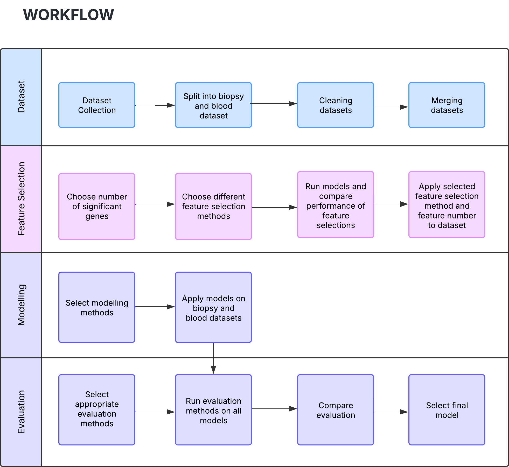
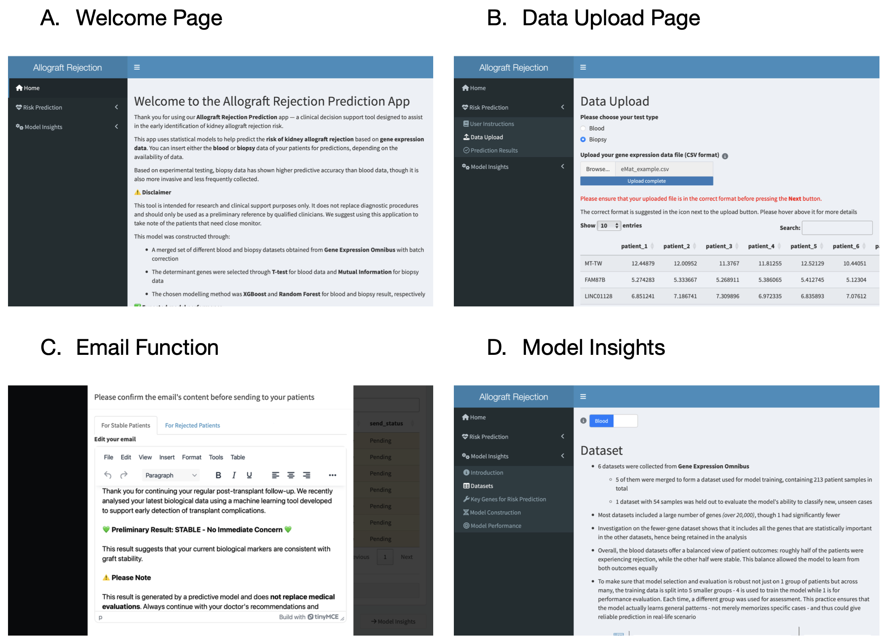

```{r figures_rds, warning = FALSE, message = FALSE}
# load necessary libraries to work with the figures
library(ggplot2)
library(patchwork)
library(ggpubr)
# load the rds file for figures generated from the appendix file
plots = readRDS('../reports/plots_finalReport.rds')
conf_mat = readRDS('../reports/models_evaluation.rds')
```

# Executive Summary

Kidney allograft is a desirable treatment option for individuals living with end-stage kidney disease. With the number of kidney donors being limited, and the percentage of patients experiencing rejection within the first-year post-transplant being high, predicting transplant outcomes is crucial in early diagnosis and treatment.

The aim of this study is to generate an application designed for clinicians to predict kidney allograft outcomes using genomic data collected from biopsy or peripheral blood samples. Such applications allow continuous monitoring and have a patient-centred approach, improving quality of life and reducing the need to return to lifelong dialysis.

To generate our application, our workflow follows the structure seen in *Figure 1*. From our analysis mutual information was used to find the top 200 significant genes for the biopsy dataset and t-test was used to find the top 400 significant genes for the blood dataset. The final selected models were Random Forest (RF) and XGBoost for biopsy and blood respectively.

Our application aligns with the growing prevalence of eHealth and aims to provide preliminary predictions that allows clinicians to recommend prehabilitation to patients at risk of rejecting kidney allografts. Furthermore, the option to choose blood or biopsy data may reduce the need for invasive procedures for prediction.



***Figure 1. DATA3888 Kidney Allograft Project Workflow***

# Background

Kidney allograft is the procedure in which tissue or cells are taken from a genetically different donor and transplanted into a patient with dysfunctional kidneys (Naik & Shawar., 2023). It is a treatment option for patients with end-stage kidney disease as it improves individual quality of life and survival compared to dialysis. Kidney allograft rejection is the main downfall of long-term kidney transplant survival with approximately 25% of patients receiving a solid organ transplant experiencing rejection by the end of the first-year post-transplant (Higdon et al., 2023). Therefore, detecting rejection is crucial in improving early intervention and patient outcomes. Allograft dysfunction after a kidney transplant manifests as an increase in serum creatinine concentration, corresponding to a decrease in the estimated glomerular filtration rate. This concentration is usually used as the measure of the kidney allograft function. Although usually asymptomatic, possible symptoms of allograft dysfunction include proteinuria, sudden reduction in urine output and pain over the allograft site (Goldberg et al., 2016).

Our goal is to construct an application that can help clinicians predict whether a kidney allograft will be rejected or stable based on the genes of a patient. Although biopsy data is considered the “gold standard” for diagnosis (Al-Awwa et al., 1998), collection is invasive, while blood data, although not as accurate, is more accessible. We therefore provide the clinician an option to use either biopsy or blood data, acknowledging that different patients may have different information available to them.

### Feature Selection Methods

Feature selection aims to identify the key features that are relevant for statistical model construction. Below are common feature selection methods.

The Limma package is a crucial feature selection component in computing differential expression (DE) gene analysis and is a popular choice for analysing microarray data (Ritchie et al., 2015). DE gene analysis uses normalised gene expression data and performs statistical analysis to find genes that have greater expression differences between the experimental and control group (EMBL-EBI, n.d.).

Mutual information (MI) is a forward feature selection method that measure the amount of randomness shared between two variables. In the context of gene expression, MI determines the degree of dependence between two genes, and a scoring function determines which features to select (Li, 2016 & Popov, 2023).

Fisher’s score is an approach that ranks features on their ability to differentiate classes in the dataset. This method computes and ranks scores for each gene where scores correlate to importance (Rosdid, 2023).

T-tests is a traditional method that detects the difference between the mean of two populations. In this project, the differences between genes are calculated and ranked by p-values (Chen et al., 2005).

Self-assembling manifold (SAM) is a dimension reduction method that uses gene relevance to select significant genes. It starts by looking for genes with different expression patterns between randomly chosen cell groups. The average difference between each group is then used to re-classify the cells and this process repeats until groups are indistinguishable and changes are stable. The primary mechanism of this feature selection is the assignment of weight based on spatial difference (Tarashansky et al., 2019).

Network theory is an existing application in kidney transplantation cases and thus was applied as a novel feature selection method to rank gene importance (Wu et al., 2014). Some key network centrality metrics used to rank gene importance include degree, betweenness, PageRank, eigenvector centrality, and k-core number.

The metrics are defined as follows (*Appendix 1*):

-   Degree centrality reflects the number of direct connections a gene has, weighted by the correlation strength

-   The betweenness centrality of a gene quantifies how often a gene lies on the shortest path between other pairs of genes, capturing its role as a potential information bottleneck.

-   PageRank centrality measures the relative importance of a gene based on both the number and quality of its connections, assigning higher scores to genes linked to other highly connected genes.

-   Eigenvector centrality assigns higher scores to genes that are connected to other highly central genes, capturing influence through both direct and indirect connections.

-   K-core numbers capture the largest subgraph in which the gene is connected to at least k other genes, reflecting its embeddedness within densely connected regions of the network (Seidman, 1983). K-core numbers have been widely applied in biological networks, highlighting their potential relevance in gene co-expression analysis.

### Model selection

Machine learning models classify gene expression data and predict outcomes.

Logistic regression (LG) is a supervised machine learning algorithm, used to predict binary categorical outcomes. It examines the relationship between predictor variables and an output variable (Lee, 2025).

Support vector machine (SVM) is another supervised machine learning algorithm used for classifying genes. The objective of the model is to maximise the margins between two classes (between hyperplane and datapoint), where larger margins indicate better performance. New datapoints are classified in relation to this hyperplane (Aswathisasidharan, 2025).

Random Forest is a set of decision trees, used to classify genes and predict outcomes. The model starts with randomly selecting genes and finding the best split point to create the first branch. The same process continues until no further split improves the purity of the terminal node. This tree-like structure is the repeated numerous times and can be pruned to avoid overfitting (Sruthi, 2025).

K-nearest neighbour (KNN) classifier assigns genes to two classes without knowing the labels of the outcome variable. The model works by calculating the distance between genes and grouping those closest as a cluster. The distances between clusters are also compared and grouped together depending on the number of neighbours. The model stops when we have two distinct clusters (Zhang, 2016).

XGBoost is a gradient boosting framework that utilises decision trees and applies regularisation techniques. It is an algorithm that combine the predictions from multiple individual models iteratively to make final predictions. During training, gradient descent optimisation is used to minimise function loss. Weak learners are sequentially added to the ensemble where errors made by existing learners are corrected for (Tyagi, 2025).

### About the dataset

Our datasets were merged from microarray datasets with binary outcome variables found on GEO omnibus database. The datasets used are as follows:

-   Biospy: GSE343, GSE50084, GSE53605, GSE138043, GSE14328, GSE1563, GSE19130, GSE26578, GSE34437, GSE75693, GSE9493, GSE107503, GSE69677 and GSE76882

-   Blood: GSE51675, GSE15296, GSE46474, GSE50084, GSE1563, GSE20300 and GSE22707

Our merged datasets had the dimensions:

-   Biopsy: 7065 genes, 1182 gene samples

-   Blood: 8557 genes, 213 gene samples

# Method

We began by examining the datasets available for kidney allograft outcomes and restricted our analysis to datasets only of microarray type, ensuring platform consistency. To simplify merging and analysis, we initially considered using datasets with Ensembl gene identifiers. However, due to limited availability, inconsistent annotation, and difficulty in implementation, we ultimately proceeded to use gene symbols.

Following this, we only retained datasets containing an outcome column, converting risk outcomes to reject. Based on availability, clinical relevance and practicality, we decided to focus on blood and biopsy datasets, which were first cleaned individually and later merged by type into two separate datasets.

To clean the data, we first removed genes that have constant expression across all samples for each dataset, relabelled gene IDs to gene symbols. For duplicated symbols, we used Limma to keep only the most significant gene.

```{r eval=FALSE}
limma_duplicates = function(eMat, fdata, pdata) {
  # filter out genes that have been excluded from eMat
  fdata = fdata %>% filter(ID %in% rownames(eMat))
  # extract genes with duplicated gene symbols in feature data
  f_duplicates = fdata |> group_by(gene_symbols) |> filter(n() > 1)
  f_uniques = fdata |> group_by(gene_symbols) |> filter(n() == 1)
  # group these genes by their gene symbols
  f_groups = f_duplicates |> group_split()
  # create an empty list to store gene ids of those with significant values
  sig_gid = character(length = length(f_groups))
  # create design matrix based on the outcome
  design = model.matrix(~pdata$outcome)
  # loop through each group of duplicated gene symbols
  for (i in 1:length(f_groups)) {
    group = f_groups[[i]]
    # filter the expression matrix to only include the gene symbol being considered
    e_duplicated = eMat[as.character(group$ID),]
    # fit limma
    fit = lmFit(e_duplicated, design) |> eBayes()
    ranking = topTable(fit)
    # select the 1st ranked to be the significant gene
    sig_gid[i] = rownames(ranking)[1]
  }
  # retain only the ides with unique gene symbols and the significant genes in the duplicated ones
  f_retain = c(f_uniques$ID, sig_gid)
  e = eMat[f_retain,]
  # change the rownames of the expression matrix into gene symbols
  rownames(e) = fdata[rownames(e),]$gene_symbols
  return(e)
}
```

Datasets that contained both blood and biopsy samples were also separated based on datatype. Metadata analysis highlighted which expression datasets needed to be log2 transformed.

For each data type, one dataset was randomly selected as the unseen test dataset for final model evaluation. The other datasets were merged using COMBAT. We applied Limma to datasets with fewer genes to decide whether it should be included in the merged training dataset based on the adjusted p-value (p\<0.01). Datasets were initially merged naively without batch correction and later batch corrected within the cross-validation folds during the test-train split. Our folds during cross validation were controlled to have an approximately equivalent number of reject and stable samples from each dataset to make them comparable and generalisable.

PCA plots were generated to ensure batch correction removed the source effect from each dataset (*Figure 2*).

```{r eval=FALSE}
# get a list of genes that all datasets have
common_genes = intersect(rownames(eGSE15296), rownames(eGSE20300))
common_genes = intersect(common_genes, rownames(eGSE22707))
common_genes = intersect(common_genes, rownames(eGSE46474))
common_genes = intersect(common_genes, rownames(eGSE50084))
common_genes = intersect(common_genes, rownames(eGSE1563))
# retain only the genes that all datasets have in each individual dataset
eGSE15296_subset = eGSE15296[which(
  rownames(eGSE15296) %in% common_genes), ]
eGSE20300_subset = eGSE20300[which(
  rownames(eGSE20300) %in% common_genes), ]
eGSE22707_subset = eGSE22707[which(
  rownames(eGSE22707) %in% common_genes), ]
eGSE46474_subset = eGSE46474[which(
  rownames(eGSE46474) %in% common_genes), ]
eGSE1563_subset = eGSE1563[which(
  rownames(eGSE1563) %in% common_genes), ]
# order the individual expression matrices so that they are in the same order regarding gene symbols
eGSE15296_ordered = eGSE15296_subset[match(
  common_genes, rownames(eGSE15296_subset)), ]
eGSE20300_ordered = eGSE20300_subset[match(
  common_genes, rownames(eGSE20300_subset)), ]
eGSE22707_ordered = eGSE22707_subset[match(
  common_genes, rownames(eGSE22707_subset)), ]
eGSE46474_ordered = eGSE46474_subset[match(
  common_genes, rownames(eGSE46474_subset)), ]
eGSE1563_ordered = eGSE1563_subset[match(
  common_genes, rownames(eGSE1563_subset)), ]
# merge everything without the batch effect
X_train = cbind(eGSE15296_ordered,
                     eGSE20300_ordered,
                     eGSE22707_ordered,
                     eGSE46474_ordered,
                     eGSE1563_ordered
                     )
# pca graph of the merged dataset without combat, colouring by original dataset
pca = prcomp(t(X_train), center = TRUE, scale. = TRUE)
p1 = pca$x |> 
  data.frame() |> 
  mutate(dataset = c(rep('GSE15296', nrow(pGSE15296)),
                     rep('GSE20300', nrow(pGSE20300)),
                     rep('GSE22707', nrow(pGSE22707)),
                     rep('GSE46474', nrow(pGSE46474)),
                     rep('GSE1563', nrow(pGSE1563))
                     )) |> 
  ggplot(aes(x = PC1, y = PC2, color = dataset)) +
  geom_point(size = 3) + theme_bw()# number each sample by the dataset they come from
batch = c(rep(1, ncol(eGSE15296)),
          rep(3, ncol(eGSE20300)),
          rep(4, ncol(eGSE22707)),
          rep(5, ncol(eGSE46474)),
          rep(6, ncol(eGSE1563)))
# merge the dataset with batch effect fixing
X_train_batched = ComBat(dat = X_train,
                    batch = batch,
                    mod = NULL,
                    par.prior = TRUE,
                    prior.plots = FALSE)
# graph pca for batch effect visualized
pca_combat = prcomp(t(X_train_batched), center = TRUE, scale. = TRUE)
p2 = pca_combat$x |> 
  data.frame() |> 
  mutate(dataset = c(rep('GSE15296', nrow(pGSE15296)),
                     rep('GSE20300', nrow(pGSE20300)),
                     rep('GSE22707', nrow(pGSE22707)),
                     rep('GSE46474', nrow(pGSE46474)),
                     rep('GSE1563', nrow(pGSE1563))
                     )) |>
  ggplot(aes(x = PC1, y = PC2, color = dataset)) +
  geom_point(size = 3) + theme_bw()
```

```{r fig2, warning = FALSE, message = FALSE}
# Plot the PCA plots for biopsy and blood datasets
fig2_ls = list(plots$biopsy_pca_noBatch, plots$biopsy_pca_batch,
               plots$blood_pca_noBatch, plots$blood_pca_batch)
fig2 = ggarrange(plotlist = fig2_ls, ncol = 2, nrow = 2)
fig2 = annotate_figure(fig2,
                       top = text_grob("\n", size = 14),
                       bottom = '           Without Batch correction                                       With Batch correction           ',
                       left = '                                  Blood                                            Biopsy                           ')
fig2
```

***Figure 2. PCA Plots of Biopsy and Blood Datasets After Batch Correction***

Apart from merging different datasets our innovation also includes incorporating different feature selection methods. Feature selection methods (Limma, mutual information, fisher score, t-test, SAM and networks) were applied to the training dataset for each data type.

Gene co-expression networks were constructed in R using the WGCNA package by first calculating pairwise gene correlations to form an adjacency matrix, which then serves as a basis for building a gene network. A list of network centrality metrics as defined by Newman (2010), were computed for each gene, including degree, betweenness, PageRank, eigenvector centrality, and k-core number. Each gene’s metric values were min–max normalized to calculate a composite score, which was then used to rank the genes accordingly.

For each feature selection method, their performance was evaluated via cross validation. For each cross validation, batch correction was applied to the testing and training sets, and both were z-score normalised using the training set’s mean and standard deviation.

```{r eval=FALSE}
# function to ensure preprocessing are done uniformly for each selection method
fs_preproc = function(eMat = X_train, pData = y_train, test_fold) {
  # split train-test set
  pData_train = pData |> filter(fold != test_fold)
  pData_test = pData |> filter(fold == test_fold)
  eMat_train = eMat[,pData_train$geo_accession]
  eMat_test = eMat[,pData_test$geo_accession]
  # batch correct test and train set
  train_batched = ComBat(eMat_train, pData_train$original_dataset)
  test_batched = ComBat(eMat_test, pData_test$original_dataset)
  # normalize
  norm = normalize(train = train_batched, test = test_batched)
  train_normed = norm$train
  test_normed = norm$test
  return(list(x_train = train_normed,
              x_test = test_normed,
              y_train = pData_train,
              y_test = pData_test))
}
```

Different number of genes were applied iteratively to decide the optimal number of genes for each feature selection method. A RF model was used to evaluate the performance for each iteration. The optimal number of genes were decided by the average Area Under the Curve (AUC) across 5-fold on a performance plot (*Appendix – performance plots*).

```{r eval=FALSE}
# the number of significant genes to choose from
n_vals = c(10, 25, 50, 75, 100, 150, 200, 250, 300, 400, 500)
limma_perf = vector('list', length = 5 * length(n_vals))
index = 1
# create a loop for cross validation
for (i in c(1:5)) {
  # preprocess
  preproc = fs_preproc(test_fold = i)
  cv_x_train = preproc$x_train
  cv_x_test = preproc$x_test
  cv_y_train = preproc$y_train
  cv_y_test = preproc$y_test
  # feature selection (limma in this example)
  design = model.matrix(~cv_y_train$outcome)
  fit = lmFit(cv_x_train, design) |> eBayes()
  rank = topTable(fit, n = Inf)
  # loop through each possible n values
  for (n in n_vals){
    # select n top genes
    de = rownames(rank)[1:n]
    # include only n top genes in the training and the test fold
    cv_train_reduced = cv_x_train[de,]
    cv_test_reduced = cv_x_test[de,]
    # random forest built on training fold
    rf = randomForest(x = t(cv_train_reduced), y = cv_y_train$outcome)
    # evaluate model performance on the test fold
    pred_prob = predict(rf, t(cv_test_reduced), type = 'prob')[, 'reject']
    pred_class = ifelse(pred_prob > 0.5, 'reject', 'stable') |> 
      factor(levels = c('stable', 'reject'))
    # roc object to calculate auc
    roc_obj = roc(response = cv_y_test$outcome, predictor = pred_prob)
    # extract model performance and store it in the comparison table
    limma_perf[[index]] = data.frame(gene_number = n,
                                     auc = auc(roc_obj) |> as.numeric())
    index = index + 1
  }
}
# calculate the overall performance of each n value
limma_perf = limma_perf |> bind_rows() |> drop_na()
limma_rank = limma_perf |> 
  group_by(gene_number) |> 
  summarise(mean_auc = mean(auc)) |> 
  arrange(desc(mean_auc))
# visualize the performance of each n
(ggplot(data = limma_rank_long, 
        aes(x = gene_number, y = value)) +
    geom_line() + 
    labs(x = 'Number of genes', y = 'Area Under the Curve (AUC)', title = 'Performance of Limma with different numbers of genes on Blood data') + 
    theme_bw()) |> 
  ggplotly()
limma_rank |> datatable(colnames = c('Gene number', 'Mean AUC'))
# optimal n
best_avg_perf[[1]] = data.frame(method = rep('Limma', 5),
                                limma_perf |> 
                                  filter(gene_number == 300))
```

AUC measures the method's ability to discriminate between binary classes regardless of the decision threshold. In the later stages of model selection, decision thresholds would be treated as a hyperparameter for fine-tuning. Based on the optimal number of genes for each method, we compared their performance and selected the best method based on AUC (*Figure 3*).

```{r eval=FALSE}
best_avg_perf = best_avg_perf |> bind_rows()
best_avg_perf_long = best_avg_perf |> 
  pivot_longer(cols = auc, names_to = 'metric', values_to = 'value')
p3 = ggplot(best_avg_perf_long, aes(x = factor(method), y = value, fill = gene_number)) +
  geom_boxplot() +
  labs(
    title = 'B. Blood',
    y = 'Area Under Curve (AUC)', x = 'Feature Selection Methods'
  ) + 
  scale_fill_gradient(
    name = 'Gene Number', 
    low = 'white', 
    high = 'black'
  ) +
  theme_bw()
p3 |> ggplotly()
best_avg_perf %>% 
  group_by(method, gene_number) %>% 
  summarise(mean_auc = mean(auc)) %>% 
  arrange(desc(mean_auc)) |> 
  datatable(colnames = c('Method', 'Gene number', 'Mean AUC'))
```

```{r fig3, warning = FALSE, message = FALSE}
fig3_ls = list(plots$biopsy_feature_selection, plots$blood_feature_selection)
fig3 = ggarrange(plotlist = fig3_ls, ncol = 2, nrow = 1, common.legend = TRUE, legend = "bottom")
fig3
```

***Figure 3. Boxplots of AUC of Feature Selection Methods on Biopsy and Blood Datasets, Coloured by Significant Number of Top Genes***

After selecting the most suitable feature selection method, various models were created (logistic regression, SVM, RF, KNN and XGBoost). Cross validation was implemented to fine tune the hyperparameters including decision thresholds, for each model. Within each cross validation, training and testing sets were batch corrected, and z-score normalised independently using the training mean and standard deviation.

```{r eval=FALSE}
# function to ensure preprocessing are done uniformly for each selection method
blood_preproc = function(eMat = X_train, pData = y_train, test_fold) {
  # split train-test set
  pData_train = pData |> filter(fold != test_fold)
  pData_test = pData |> filter(fold == test_fold)
  eMat_train = eMat[,pData_train$geo_accession]
  eMat_test = eMat[,pData_test$geo_accession]
  # batch correct test and train set
  train_batched = ComBat(eMat_train, pData_train$original_dataset)
  test_batched = ComBat(eMat_test, pData_test$original_dataset)
  # normalize
  norm = normalize(train = train_batched, test = test_batched)
  train_normed = norm$train
  test_normed = norm$test
  # feature selection
  de = blood_de(train_normed, pData_train)
  train_de = train_normed[de,]
  test_de = test_normed[de,]
  return(list(x_train = train_de,
              x_test = test_de,
              y_train = pData_train,
              y_test = pData_test))
}
```

```{r eval=FALSE}
# function to ensure preprocessing are done uniformly for each selection method
biopsy_preproc = function(eMat = X_train, pData = y_train, test_fold) {
  # split train-test set
  pData_train = pData |> filter(fold != test_fold)
  pData_test = pData |> filter(fold == test_fold)
  eMat_train = eMat[,pData_train$geo_accession]
  eMat_test = eMat[,pData_test$geo_accession]
  # batch correct test and train set
  train_batched = ComBat(eMat_train, pData_train$original_dataset)
  test_batched = ComBat(eMat_test, pData_test$original_dataset)
  # normalize
  norm = normalize(train = train_batched, test = test_batched)
  train_normed = norm$train
  test_normed = norm$test
  # feature selection
  de = biopsy_de(train_normed, pData_train)
  train_de = train_normed[de,]
  test_de = test_normed[de,]
  return(list(x_train = train_de,
              x_test = test_de,
              y_train = pData_train,
              y_test = pData_test))
}
```

The chosen feature selection methods were applied to the training sets, retaining only significant genes for model construction.

```{r eval=FALSE}
# t-test
blood_de = function(eMat_train, pData_train) {
  # perform t-test per gene
  t_test = apply(eMat_train, 1, function(gene) {
    t.test(gene~pData_train$outcome)$p.value
  })
  # arrange genes with ascending p-value resulted from the t-test
  rank = data.frame(
    row.names = rownames(eMat_train),
    pval = t_test
  ) |> arrange(pval)
  # select the top 400 genes (based on blood data's feature selection section)
  return(rownames(rank)[1:400])
}
```

```{r eval=FALSE}
# mutual information
biopsy_de = function(eMat_train, pData_train) {
  # discretize the data
  eMat_disc = discretize(eMat_train, dis = 'equalfreq')
  # compute mutual information between each gene and the class labels
  mi_scores = apply(eMat_disc, 1, function(gid) mutinformation(gid, pData_train$outcome))
  # rank and select top features
  genes = eMat_train |> rownames()
  mi_result = data.frame(genes)
  mi_result$score = mi_scores
  mi_rank = mi_result |> arrange(desc(score))
  return(mi_rank$genes[1:200])
}
```

For each of the defined hyperparameters, a model was built on the train set and assessed on the test set. The best fine-tuned hyperparameter combination was based on F1 and F2 scores ($0.4 \times F1 + 0.6 \times F2$), focusing on the maximising the recall rate without classifying everything as reject.

```{r eval=FALSE}
k_vals = c(1, 3, 5, 7, 10, 15, 25)
knn_perf = vector('list', 5 * length(k_vals) * length(thresholds))
index = 1
for (i in 1:5) {
  preproc = blood_preproc(test_fold = i)
  cv_train_reduced = preproc$x_train
  cv_test_reduced = preproc$x_test
  cv_y_train = preproc$y_train
  cv_y_test = preproc$y_test
  for (k in kx_vals) {
    knn = knn3(t(cv_train_reduced), cv_y_train$outcome, k = k)
    pred_prob = predict(knn, t(cv_test_reduced))[,'reject']
    for (t in thresholds) {
    pred_class = ifelse(pred_prob > t, 'reject', 'stable') %>%
      factor(levels = c('stable', 'reject'))
    conf_mat = confusionMatrix(data = pred_class,
                              reference = cv_y_test$outcome, positive = 'reject')
    knn_perf[[index]] = data.frame(k = k, threshold = t,
                                  f1 = conf_mat$byClass['F1'],
                                  f2 = f2(pred_class, cv_y_test))
    index = index + 1
    }
  }
}
knn_perf = bind_rows(knn_perf)
knn_rank = knn_perf |>
  group_by(k, threshold) |>
  summarise(mean_f1 = mean(f1),
            mean_f2 = mean(f2)) |>
  arrange(desc(0.4 * mean_f1 + 0.6 * mean_f2), threshold)
model_selection[[1]] = data.frame(method = rep('KNN', 5),
                                  knn_perf |>
                                    filter(k == knn_rank$k[1]) |> 
                                    filter(threshold == knn_rank$threshold[1]) |> 
                                    select(-c(k, threshold)))
```

The final model was selected by comparing the fine-tuned models with each other based on F1 and F2 scores. The training data was fed into the best fine-tuned model, and external model evaluation was performed using the unseen testing dataset.

```{r eval=FALSE}
# batch correction
train_batched = ComBat(X_train, y_train$original_dataset)
# normalize
norm = normalize(train_batched, X_test)
train_normed = norm$train
test_normed = norm$test
# feature selection
de = blood_de(train_normed, y_train)
train_de = train_normed[de,]
test_de = test_normed[de,]
# create data matrix for xgb
dtrain = xgb.DMatrix(data = t(train_de),
                     label = ifelse(y_train$outcome == 'stable', 0, 1))
dtest = xgb.DMatrix(data = t(test_de))
# fine-tuned xgb parameters
best_eta = xgb_rank$eta[1]
best_max_depth = xgb_rank$max_depth[1]
best_nrounds = xgb_rank$nrounds[1]
best_threshold = xgb_rank$threshold[1]
# model construction
params = list(objective = 'binary:logistic',
              eval_metric = 'aucpr',
              eta = best_eta,
              max_depth = best_max_depth)
xgb = xgb.train(params = params, data = dtrain, nrounds = best_nrounds, verbose = 0)
# perform model on test set
pred_prob = predict(xgb, dtest)
pred_class = ifelse(pred_prob > best_threshold, 'reject', 'stable') |> 
  factor(levels = c('stable', 'reject'))
# performance evaluation
confusionMatrix(data = pred_class, reference = y_test$outcome, positive = 'reject')
```

Our primary evaluation metric was sensitivity to avoid misclassifying patients with rejection as stable to therefore minimise clinical risk.

Our shiny application (<https://maiminhhh.shinyapps.io/data3888-biomed22/>) was constructed based on these models. It is designed to allow clinicians to input blood or biopsy data depending on the availability and predict kidney allograft outcomes. Our application provides an immediate interface between clinician and patients where an email function allows direct communication with patients about their results; guiding further action (*Figure 4*). We integrated an additional model insights page to be transparent with clinicians and other application users about the process of model construction and evaluation.



***Figure 4. Shiny Application Pages***

# Results

The best feature selection methods were those with stable performance and high mean AUC.

For the biopsy dataset mutual information was chosen using the top 200 significant genes, while for the blood dataset, t-test with top 400 significant genes was selected (*Figure 3*).

From *Figure 5*, the model built using our best feature selection method portrays the best performing model to be RF for biopsy and XGBoost for blood.

```{r fig5, warning = FALSE, message = FALSE}
fig5_ls = list(plots$biopsy_model, plots$blood_model)
fig5 = ggarrange(plotlist = fig5_ls, ncol = 1, nrow = 2)
fig5
```

***Figure 5. Boxplots of F1 and F2 Performance of Different Feature Selection Methods*** ***on Biopsy and Blood Dataset***

Biopsy Model Performance:

```{r biopsy_confMat, warning = FALSE, message = FALSE}
conf_mat$biopsy$table
conf_mat$biopsy$byClass[c('Sensitivity', 'Specificity', 'F1')]
```

Blood Model Performance:

```{r blood_confMat, warning = FALSE, message = FALSE}
conf_mat$blood$table
conf_mat$blood$byClass[c('Sensitivity', 'Specificity', 'F1')]
```

# Discussion

The RF model was selected for biopsy as it has significantly higher F1 performance, and a relatively high F2 performance while for blood, the XGBoost model was chosen due to its high F1 performance, and fourth highest F2 performance (*Figure 5*).

The biopsy model has a higher accuracy than the blood model, consistent with previous knowledge that biopsies are the gold standard for diagnosing allograft rejection (Al-Awwa et al., 1998). The majority of AI models used for kidney allograft diagnostic purposes were RF and SVM models (Alamgir et al., 2022), consistent with our selection of the RF model for the biopsy dataset.

In terms of model performance, the biopsy model had high sensitivity (0.9286) and moderate specificity (0.6364), indicating slight bias towards predicting rejection. However, its balanced performance suggests good robustness and generalisability. The blood model shows high sensitivity (0.8571) and low specificity (0.3077), which indicates stronger bias to rejection predictions and suggests lower generalisability and robustness (*Refer to Results*).

Both models were constructed to maximise sensitivity as the clinical implications of misclassifying a rejection patient as stable is significantly worse than vice-versa. Similarly, although this may have reduced biological nuance, we grouped risk categories such as CNIT, Banff into the ‘reject’ class to prioritise clinical safety.

In constructing the network, various factors were considered to ensure validity.

WGCNA was selected for its well-established application in module detection and gene selection (Langfelder et al., 2008). To emphasise strong gene-gene correlations while diminishing the influence of weaker associations to mimic biological networks, correlation values were raised to a soft-thresholding power. As justified by Langfelder et al., a scale-independence of 0.80 was targeted, balancing the trade-off between achieving a scale-free network structure and preserving mean connectivity. Accordingly, a soft-thresholding power $\beta$ of 9 was selected for the blood dataset and 10 for the biopsy dataset using R’s pickSoftThreshold function.

Moreover, when constructing the adjacency matrix, the (i,j)-entry of the matrix was $a_{ij} \;=\; \bigl|\mathrm{cor}(x_i,\,x_j)\bigr|^\beta$ between genes i and j. Python’s networkX package was used both to build the network and to implement the metrics. These metrics were selected based on their low inter-correlation, ensuring that each contributes distinct information to the analysis.

Our project faced several limitations due to constraints in domain expertise, data availability and methodological challenges:

Due to our limited domain knowledge, it was difficult to determine the most appropriate metrics for top genes selection in networking. Although there is a strong alignment between network-based importance scores and biological relevance, the incorporation of additional differential expression analysis such as t-test may have been able to strengthen the biological interpretability of the selected genes. However, since our goal was the comparison of different feature selection strategies, we found that t-test-based feature selection offered better performance. Future work may benefit from consulting experts in biological networking to optimise feature selection.

Secondly, using gene symbols rather than Ensembl Gene IDs may have introduced ambiguity as multiple gene IDs are associated with each gene symbol. Although we attempted to mitigate this by using Limma to select the most significant duplicates, doing this may have reduced biological specificity and impacted the robustness and generalisability of our models.

Thirdly, as our datasets originated from different sources and were not the same scale, we performed batch correction on the training dataset. However, we are unable to perform consistent batch correction on unseen testing data, therefore limiting generalisation. Furthermore, the use of batch correction to prevent data leakage may have left behind residual noise that could confound high-dimensional data as seen in transcriptomics.

# Conclusion

Therefore, we applied mutual information and t-test as the feature selections for biopsy and blood data, respectively. The top 200 genes selected for biopsy were used to construct a RF model, and the top 400 genes selected for blood were used to construct a XGBoost model. These models were the basis for our shiny application aligning itself with the growing potential of eHealth in patient-centred interventions (Falevai & Hassandoust, 2025). Our application is significant as it allows clinicians to identify patients who require interventions to recommend commencement of prehabilitation during the preoperative period of kidney allografts (Briggs et al., 2024). Future projects could integrate other recipient and donor characteristics such as age and gender into the prediction model (Lafont et al., 2025).

# Student Contributions

```{r, echo=FALSE}
library(knitr)

student_contributions <- data.frame(
  Task = c("Datasets", "", "", 
           "Feature Selection", "", "", "", 
           "Modelling", "", 
           "Shiny App", "", "", 
           "Presentation", "", "", "", 
           "Report", "", ""),
  Subtask = c("Selecting datasets", "Cleaning datasets", "Merging datasets",
              "Networking", "Developing code for feature selection", "Evaluation of initial feature selection", "Cross validation –performance plots",
              "Initial code for modelling", "Cross validation, hyper-parameter tuning (based on previous code)",
              "App construction and detailing", "Homepage contents writing", "Simplification of diagram",
              "Script writing", "Presentation construction", "Workflow diagram", "Presenting",
              "Workflow diagram", "Writing", "Consolidation of code"),
  Person = c("All", 
             "Celine, Yuanfeng, Zhiyuan (Biopsy); Boyi, Minh (Blood)",
             "Initially: Minh, Zhiyuan; Redone by Minh",
             "Rishi",
             "Minh, Celine, Zhiyuan, Yuanfeng",
             "Boyi",
             "Boyi, Minh",
             "Boyi (blood), Yuanfeng (biopsy)",
             "Minh, Yuanfeng",
             "Minh",
             "Celine",
             "Yuanfeng",
             "Celine, Rishi, Boyi",
             "Boyi, Rishi, Celine",
             "Celine",
             "Rishi, Celine, Minh, Boyi, Yuanfeng",
             "Celine",
             "Rishi, Boyi, Celine",
             "Zhiyuan, Minh")
)

# Display with kable
kable(student_contributions, caption = "Student Contributions Table")

```

# References

Alamgir, A., Hussein, H., Abdelaal, Y., Abd-Alrazzaq, A. and Househ, M. (2025). Artificial Intelligence in Kidney Transplantation: A Scoping Review. In: Studies in Health Technology and Informatics, 294, pp.254–258. IOS Press. Available at: <https://ebooks.iospress.nl/doi/10.3233/SHTI220448>

Briggs, J., Chilcot, J. & Greenwood, S.A., 2024. The use of digital health interventions to deliver prehabilitation in solid organ transplant recipients: are we there yet?. Current Opinion in Organ Transplantation, 29(5), pp.357–362. <https://doi.org/10.1097/MOT.0000000000001164>

Chen, D., Liu, Z., Ma, X. and Hua, D. (2005). Selecting genes by test statistics. Journal of Biomedicine and Biotechnology, 2005(2), pp.132–138. Available at: <https://pmc.ncbi.nlm.nih.gov/articles/PMC1184045/>

EMBL-EBI (n.d.). Differential gene expression analysis \| Functional genomics II. \[online\] EMBL-EBI. Available at: <https://www.ebi.ac.uk/training/online/courses/functional-genomics-ii-common-technologies-and-data-analysis-methods/rna-sequencing/performing-a-rna-seq-experiment/data-analysis/differential-gene-expression-analysis/>

Falevai, I., & Hassandoust, F. (2025). Enhancing Transplantation Care with eHealth: Benefits, Challenges, and Key Considerations for the Future. Future Internet, 17(4), 177. <https://doi.org/10.3390/fi17040177>

GeeksforGeeks. (2025). Support Vector Machine (SVM) Algorithm. Available at: <https://www.geeksforgeeks.org/support-vector-machine-algorithm/>

Goldberg, R.J., Weng, F.L. and Kandula, P.M. (2016). Acute and chronic allograft dysfunction in kidney transplant recipients. Medical Clinics of North America, 100(3), pp.487–503. Available at: <https://pubmed.ncbi.nlm.nih.gov/27095641/>

Higdon, L.E., Tan, J.C. and Maltzman, J.S. (2023) ‘Infection, Rejection, and the Connection’, Transplantation, 107(3), pp. 584–595. Available at: <https://pmc.ncbi.nlm.nih.gov/articles/PMC9968362/>

Lee, F. (n.d.). What is logistic regression? IBM. Available at: <https://www.ibm.com/think/topics/logistic-regression>

Newman, M.E.J. (2010). Networks: An Introduction. Oxford: Oxford University Press. Available at: <https://direct.mit.edu/artl/article-abstract/18/2/241/2703/Networks-An-Introduction-Mark-E-J-Newman-2010>

Naik, R.H. and Shawar, S.H. (2020) Renal Transplantation Rejection. StatPearls \[Internet\]. Treasure Island (FL): StatPearls Publishing. Available at: <https://www.ncbi.nlm.nih.gov/books/NBK553074/>

Popov, A. (2023) ‘Feature engineering methods’, in Pal, Kunal, Ari, Samit, Bit, Arindam and Bhattacharyya, Saugat (eds.) Advanced Methods in Biomedical Signal Processing and Analysis. Academic Press. Available at: <https://doi.org/10.1016/B978-0-323-85955-4.00004-1>

Ritchie, M. E., Phipson, B., Wu, D., Hu, Y., Law, C. W., Shi, W., & Smyth, G. K. (2015). limma powers differential expression analyses for RNA-sequencing and microarray studies. Nucleic acids research, 43(7), e47. <https://doi.org/10.1093/nar/gkv007>

Rosidi, N. (2023). Advanced Feature Selection Techniques for Machine Learning Models. \[online\] KDnuggets. Available at: <https://www.kdnuggets.com/2023/06/advanced-feature-selection-techniques-machine-learning-models.html>

S. B. Seidman. Network structure and minimum degree. Social Networks, 5(3): 269–287, 1983. doi: <https://doi.org/10.1016/0378-8733(83)90028-x>.

Sruthi. (2025). Random Forest Algorithm in Machine Learning. Analytics Vidhya. Available at: <https://www.analyticsvidhya.com/blog/2021/06/understanding-random-forest/#h-what-is-random-forest>

Tarashansky, A.J., Xue, Y., Li, P., Quake, S.R. and Wang, B. (2019). Self-assembling manifolds in single-cell RNA sequencing data. eLife, 8, e48994. Available at: [https://pmc.ncbi.nlm.nih.gov/articles/PMC6795480/](https://pmc.ncbi.nlm.nih.gov/articles/PMC6795480/#){.uri}

Tyagi, A. (2025). What is XGBoost Algorithm? Analytics Vidhya. Available at: <https://www.analyticsvidhya.com/blog/2018/09/an-end-to-end-guide-to-understand-the-math-behind-xgboost/>

Wu, D., Liu, X., Liu, C., Liu, Z., Xu, M., Rong, R., Qian, M., Chen, L. and Zhu, T. (2014). Network analysis reveals roles of inflammatory factors in different phenotypes of kidney transplant patients. Journal of Theoretical Biology, 362, pp.62–68. <https://doi.org/10.1016/j.jtbi.2014.03.006>

Zhang, Z. (2016). Introduction to machine learning: k-nearest neighbors. Annals of Translational Medicine, 4(11), p.218. Available at: <https://pmc.ncbi.nlm.nih.gov/articles/PMC4916348/>

# Appendix

Refer to Appendix.html for code outputs.

Github Repository: <https://github.sydney.edu.au/boli5379/DATA3888---Biomed-22.git>

## Appendix 1

The 5 metrics defined in the network feature selection method are mathematically expressed as follows:

#### Degree:

$$
k_i \;=\; \sum_{j \,\neq\, i} a_{ij} 
\;=\; \sum_{j \,\neq\, i} \bigl|\mathrm{cor}(x_i,\,x_j)\bigr|^\beta.
$$

#### Betweenness Centrality:

$$
C_B(v) \;=\; \sum_{\substack{s,t \in V \\ s \neq v \neq t}} 
\frac{\sigma_{st}(v)}{\sigma_{st}},
$$ where:

-   $\sigma_{st}$ is the total number of shortest paths from node $s$ to node $t$,
-   $\sigma_{st}(v)$ is the number of those shortest paths that pass through node $v$.

#### Pagerank Centrality:

$$
\mathrm{PR}(v) \;=\; \frac{1 - d}{N} \;+\; d \sum_{u \in M(v)} 
\frac{\mathrm{PR}(u)}{k_u},
$$

where:

-   $N = |V|$ is the total number of nodes in the network.\
-   $d \in (0,1)$ is the damping factor (often set to 0.85).\
-   $M(v)$ is the set of nodes that link to $v$.\
-   $k_u$ is the out-degree of node $u$, i.e., the number of outgoing edges from $u$.

#### Eigenvector Centrality:

$$
\mathbf{A}\,\mathbf{x} \;=\; \lambda\,\mathbf{x},
$$

where:

-   $\mathbf{A} = (a_{ij})$ is the adjacency matrix of the network,
-   $\lambda$ is the largest eigenvalue of $\mathbf{A}$,
-   $\mathbf{x} = (x_1, x_2, \dots, x_{|V|})^\top$ is the corresponding eigenvector,
-   $x_v$ (the $v$-th entry of $\mathbf{x}$) is the eigenvector centrality of node $v$.

#### K-core:

K-core defined as follows:

1.  **Initialization**: Start with the full graph $G = (V, E)$.
2.  **Removal Step**: Remove all nodes $v$ such that\
    $$
    \deg(v) \;<\; k,
    $$\
    along with their incident edges.
3.  **Repeat**: Recompute degrees in the remaining subgraph and again remove any node $v$ with $\deg(v) < k$.
4.  Continue until no node with $\deg(v) < k$ remains.

The resulting subgraph, denoted $G_k$, is the $k$-core. Every node in $G_k$ satisfies $\deg(v) \ge k$ within $G_k$.